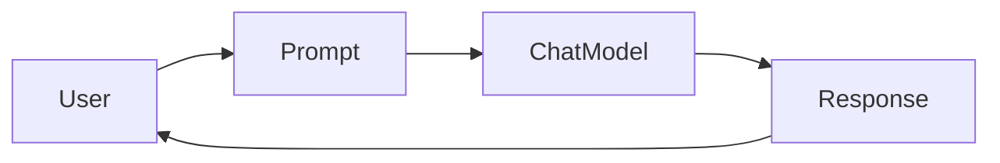

# 🚀 LangChain Learning Journey

A structured repository documenting my hands-on journey of learning **LangChain**, **LLM Engineering**, **Tool Calling**, **RAG**, and **AI Agent Development** using Python.

> Goal: Master LangChain from fundamentals to production-ready AI applications.
---
## 🏗️ LangChain Architecture

## 📚 Learning Roadmap

### ✅ 1. LangChain Introduction
- What is LangChain?
- Why LangChain?
- Core Components
- Architecture Overview
- Installation & Environment Setup

Notebook:
```
langchain/langchain_intro.ipynb
```
---

### ✅ 2. Model Integration

Topics Covered

- Integrating Google Gemini
- Chat Models
- init_chat_model()
- Model Configuration
- Temperature
- Token Usage
- Response Metadata

Notebook

```
langchain/model_intigration.ipynb
```

---

### ✅ 3. Messages

Understanding LangChain message types

- HumanMessage
- AIMessage
- SystemMessage
- ToolMessage
- Message History
- Conversation State

Notebook

```
langchain/messages.ipynb
```

---

### ✅ 4. Tools

Topics

- Creating Custom Tools
- @tool Decorator
- Tool Schemas
- Tool Arguments
- Tool Execution
- Function Calling

Examples

- Email Sender
- Weather Tool
- Calculator

Notebook

```
langchain/tools.ipynb
```

---

### ✅ 5. Tool Calling Workflow

Understanding how LLMs interact with tools.

Flow

```
User
   ↓
LLM
   ↓
Tool Selection
   ↓
Tool Execution
   ↓
Tool Result
   ↓
Final AI Response
```

Notebook

```
langchain/structure_OP.ipynb
```

---

### ✅ 6. Middleware & Observability

Topics

- LangChain Middleware
- Humanloop Integration
- Logging
- Token Tracking
- Request Monitoring
- Tool Call Inspection
- Execution Tracing

Notebook

```
langchain/middleware.ipynb
```

---

## 📂 Project Structure

```
LANG_CHAIN/
│
├── langchain/
│   ├── langchain_intro.ipynb
│   ├── model_intigration.ipynb
│   ├── messages.ipynb
│   ├── tools.ipynb
│   ├── structure_OP.ipynb
│   └── middleware.ipynb
│
├── main.py
├── .env
├── pyproject.toml
├── uv.lock
├── req.txt
└── README.md
```

---

## 🛠️ Technologies Used

- Python 3.13
- LangChain
- Google Gemini
- LangChain Google GenAI
- Humanloop
- Pydantic
- dotenv
- uv

---

## 🧠 Concepts Learned

- Chat Models
- Prompting
- Messages
- Tool Calling
- Function Calling
- Middleware
- Observability
- Token Usage
- Response Metadata
- Structured Outputs
- Conversation Flow

---
## 🎯 Upcoming Topics

- Prompt Templates
- LCEL
- Runnable Interface
- Output Parsers
- Memory
- Document Loaders
- Text Splitters
- Embeddings
- Vector Databases
- Retrieval
- RAG
- Agents
- LangGraph
- Production Deployment

---

## 🚀 How to Run

Clone the repository

```bash
git clone <repository-url>
```

Install dependencies

```bash
uv sync
```

or

```bash
pip install -r req.txt
```

Create a `.env` file

```env
GOOGLE_API_KEY=YOUR_API_KEY
```

Run notebooks using VS Code or Jupyter.

---

## 🎓 Objective

This repository is part of my journey to become an **LLM Engineer** by mastering LangChain, Retrieval-Augmented Generation (RAG), AI Agents, and production-grade Generative AI systems.

---

## ⭐ Repository Highlights

- Beginner-friendly notebooks
- Step-by-step explanations
- Practical examples
- Tool calling workflows
- Humanloop middleware integration
- Clean project organization
- Progressive learning roadmap